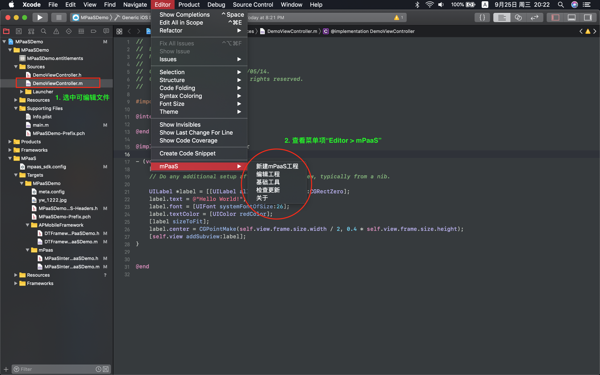
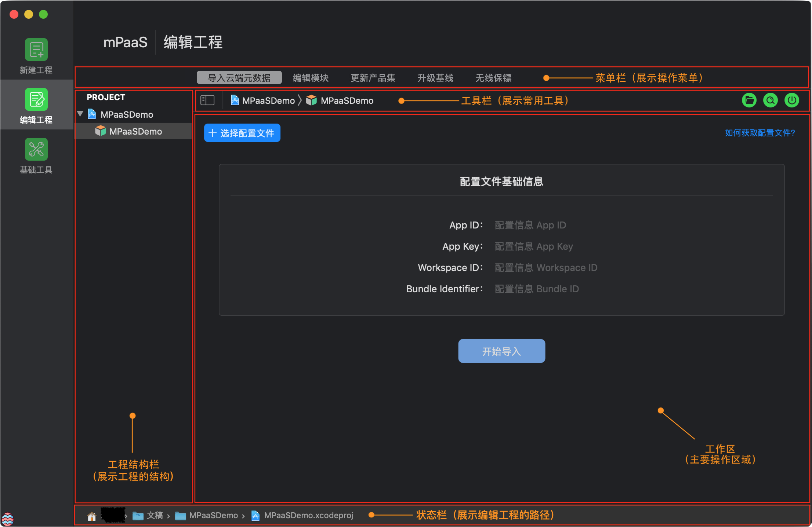

# 基于已有工程且使用 mPaaS 插件接入

假设已有 基于原生 iOS 框架 的工程，本文将引导您 使用 mPaaS Xcode Extension 插件 接入 mPaaS。

## 操作步骤

1. 安装开发者工具：mPaaS Xcode Extension 插件 。

2. [$\color{red}{在控制台创建应用}$](https://gitee.com/ylyk/technology-share/blob/master/mPaas/accessWay.md)

3. 启动 Xcode，打开已有的 基于原生 iOS 框架 开发的工程。
4. 点击 Xcode 菜单项 Editor > mPaaS > 编辑工程，打开编辑工程页面。

其他操作步骤和 **[$\color{red}{基于mPaaS框架接入}$](https://gitee.com/ylyk/technology-share/blob/master/mPaas/access-mPaas.md)** 方式相同
