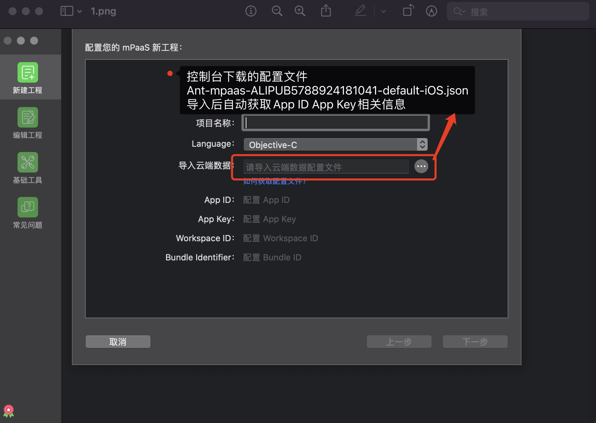
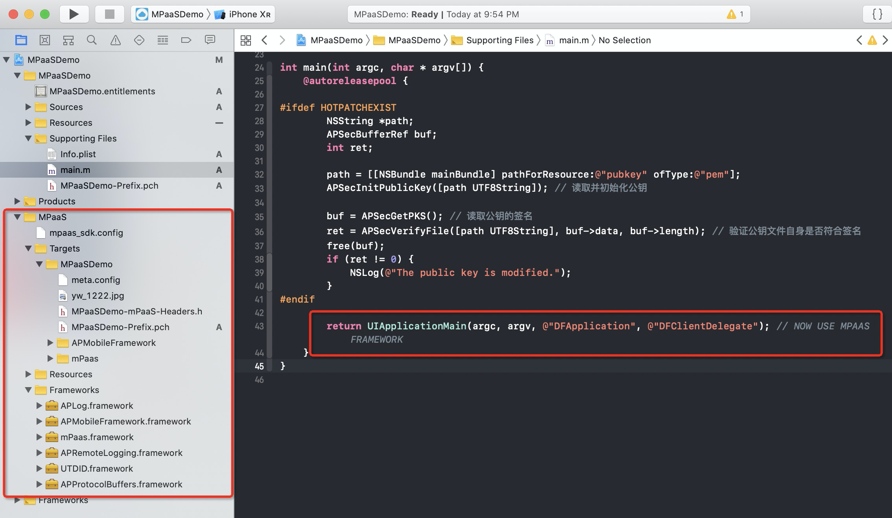

# 基于 mPaaS 框架接入

本文将引导您从零开始创建一个 基于 mPaaS 框架接入 的全新工程

## 操作步骤

1. 安装开发者工具：mPaaS Xcode Extension 插件 。

**前置条件** 
- 安装 Xcode。目前 mPaaS Xcode Extension 仅支持 9.0及以上版本的 Xcode。
- macOS 版本 ≥ 10.13。
- 未安装过 mPaaS Xcode Extension（如需升级安装，建议使用 Extension 插件内的升级功能）。

## 操作步骤

1. 在终端运行以下安装命令.

```shell
curl -sSL https://mpaas-ios.oss-cn-hangzhou.aliyuncs.com/mpaaskit/Xcode-extension/install.sh | sh
```
2. [$\color{red}{在控制台创建应用}$](https://gitee.com/ylyk/technology-share/blob/master/mPaas/consoleCreateApp.md)

3. 配置 mPaaS 新工程，输入  **项目名称**  并导入第二步中下载的  _.config_  配置文件，然后点击 下一步 按钮



4. 选择要创建应用的  **模版类型** ，然后点击 下一步 按钮


5. 选择工程使用的  **基线类型和版本** ，然后点击  **下一步**  按钮

基线类型说明：
     -  **标准基线** ：公开的标准 mPaaS SDK 版本，可以在下拉列表中选择。

     -  **定制基线** ：目前只开放给专有云用户，在输入框中填入对应的基线 ID 后会自动进行校验。


6. 选择工程需要添加的模块，然后点击  **下一步**  按钮


7. 创建成功之后会自动打开新建的 Xcode 工程。该工程包含与工程文件同级的 MPaaS 目录，与 mPaaS 相关的文件都在该目录下；更多信息，请参考  **mPaaS 目录结构** 。



8. 直接运行此工程，进行测试。

