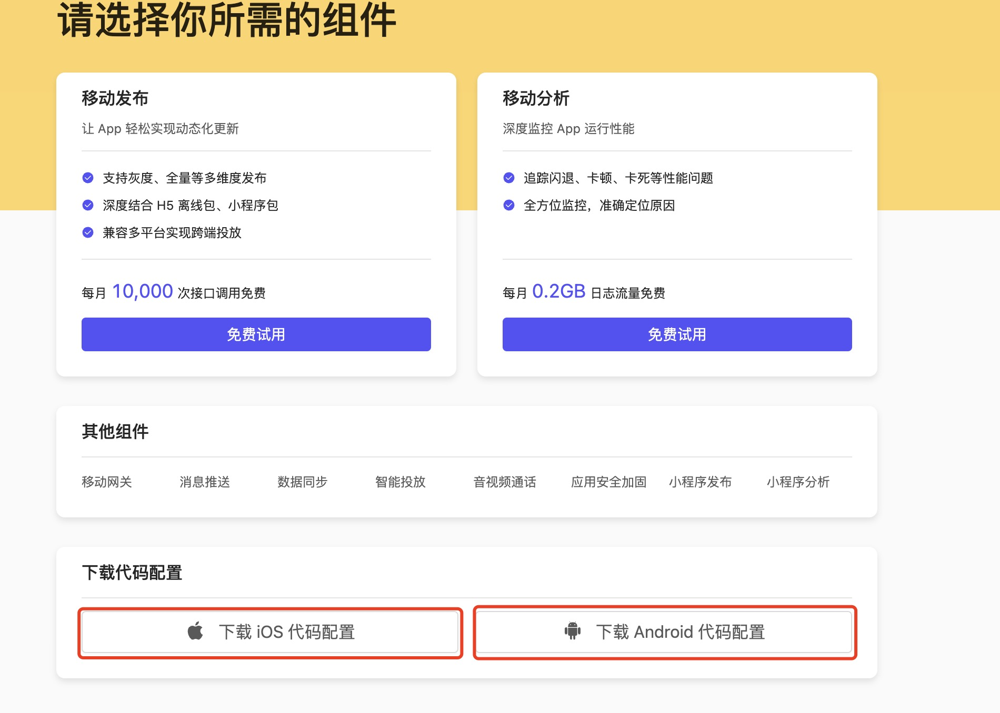

## 在控制台创建应用

要使用 mPaaS，您首先需要在 mPaaS 控制台创建应用并下载配置文件。

### 创建 mPaaS 应用

1. 登录 **mPaaS**  控制台。

2. 单击  **创建应用**  按钮。


3. 完善应用信息。

     i. 输入应用名称。示例： **库课网校** 。

    ii.单击 + 上传应用图标。您可以忽略此步骤，此时应用将使用默认图标。

4. 单击 创建 按钮，完成应用创建。您可以看到应用列表，列表里包含刚才创建的应用：


### 下载配置文件

在应用列表页，单击应用名称（如上一步中创建的应用 **库课网校**），您将看到以下页面：




> 下载的配置文件名：Ant-mpaas-ALIPUB5788924181041-default-iOS.json

配置文件内容为JSON格式，示例如下：


```
 {
	"appId":"ALIPUB5788924181041", // 小程序ID
	"appKey":"ALIPUB5788924181041_IOS", 
	"base64Code":"/9j/4AAQSkZJRgABAQEAYABgAAD/2wBDAAMCAgMCAgMDAwMEAwMEBQgFBQQEBQoHBwYIDAoMDAsKCwsNDhIQDQ4RDgsLEBYQERMUFRUVDA8XGBYUGBIUFRT/2wBDAQMEBAUEBQkFBQkUDQsNFBQUFBQUFBQUFBQUFBQUFBQUFBQUFBQUFBQUFBQUFBQUFBQUFBQUFBQUFBQUFBQUFBT/wAARCAADAAMDASIAAhEBAxEB/8QAHwAAAQUBAQEBAQEAAAAAAAAAAAECAwQFBgcICQoL/8QAtRAAAgEDAwIEAwUFBAQAAAF9AQIDAAQRBRIhMUEGE1FhByJxFDKBkaEII0KxwRVS0fAkM2JyggkKFhcYGRolJicoKSo0NTY3ODk6Q0RFRkdISUpTVFVWV1hZWmNkZWZnaGlqc3R1dnd4eXqDhIWGh4iJipKTlJWWl5iZmqKjpKWmp6ipqrKztLW2t7i5usLDxMXGx8jJytLT1NXW19jZ2uHi4+Tl5ufo6erx8vP09fb3+Pn6/8QAHwEAAwEBAQEBAQEBAQAAAAAAAAECAwQFBgcICQoL/8QAtREAAgECBAQDBAcFBAQAAQJ3AAECAxEEBSExBhJBUQdhcRMiMoEIFEKRobHBCSMzUvAVYnLRChYkNOEl8RcYGRomJygpKjU2Nzg5OkNERUZHSElKU1RVVldYWVpjZGVmZ2hpanN0dXZ3eHl6goOEhYaHiImKkpOUlZaXmJmaoqOkpaanqKmqsrO0tba3uLm6wsPExcbHyMnK0tPU1dbX2Nna4uPk5ebn6Onq8vP09fb3+Pn6/9oADAMBAAIRAxFobXF3G0SPMJ48NIDG7l+JCwhiP2kFAwABAQAAAAQAAB4AAADAAAAAFgAAAIkAAAABAAAAAAAAAAAAAAAAAAAAAAAAABUAAAABAAAAAAAAAAAAAAAIAAAAAAAAAC4XYmJ3AAAAAAAAAAAAAABeBLGVYm1D7TxOWdVkyMCYvVnSaEJMe5tS7dmEFes+c+/wCFFdTD6Zmpdu/l8ulhyHaITJtP9lBuw+iwF1cmdjbngBAwF4dWZ3AwECBgEAEQEBCAFxdHNqb3YranGggioe7EHnixUs4FScGh1/LCp/RTZeVmG6VWFgOwtEQ3ZvEFZPXcV5e5pU7QWGpmWGl79mdZOjQJMY4cBxjSvzcKRo0K9fI2jkyB8qoRfpxPmzpNUufSAyU/qYXuKHWpbCGkrpmC8i0/mQcxOmasVvKppO46sGJ0+n0YaQMQTqjZm09bNeErZMM+2CVInBTMhDQS09Fu3V7s9HKtEJ55boL/yJHMd5tsHulPihuToYJSoKyFf2txAkQZP5Twu/sc9bk32D/A8X1P8AAMKgGAYAAAAA",
	"bundleId":"com.kuke99.kukeStudent", // App应用bundleId
	"rootPath":"mpaas/ios/ALIPUB5788924181041-default",
	"workspaceId":"default",
	"syncport":"443",
	"syncserver":"msync.mpaas.cn-hangzhou.aliyuncs.com",
	"pushPort":"443",
	"pushGW":"push.mpaas.cn-hangzhou.aliyuncs.com",
	"rpcGW":"https://mgw.mpaas.cn-hangzhou.aliyuncs.com/mgw.htm",
	"logGW":"https://mdap.mpaas.cn-hangzhou.aliyuncs.com",
	"mpaasapi":"https://mpaasapi.mpaas.cn-hangzhou.aliyuncs.com/mgw.htm",
	"mrtcserver":"wss://mrtc.mpaas.cn-hangzhou.aliyuncs.com/ws",
	"mdc":"https://mdc.mpaas.cn-hangzhou.aliyuncs.com",
	"mpaasConfigVersion":"V_1.0",
	"mpaasConfigEnv":"ONEX_CLOUD",
	"mpaasConfigPluginExpired":"",
	"mpaasConfigLicense":"KAkLlkBC4TLBtL16KX9396nTxwlX3QdQjZZggdGf9oSIxYRAFFRWQzvYNXSfeFhNZJsqBEkodvIeNmxk1lzOsrmIsy0LeZ4sjuRvpweU4YSDM22rY9+xT9cFqeJhssNAmkyVWexR47/oyQ4CVhu+Kk5NVdQY6XXQtSr458VYCCTLoaeP8z7B57T6rN4FRvYSXGONiYzVDDc/i/WL4Yy0PRA4KglN9aO7uYXqkZtY+A64uF2CO3iw7GwYXM/M4vjdDzc6jxzdU4p43R2hIXzQKEspT8NHgBQOO87sNGkaxGGgdR99RM3uG+El1FCpm8k6yYe3/at5psODSh0zsWGgTg=="
}
```
