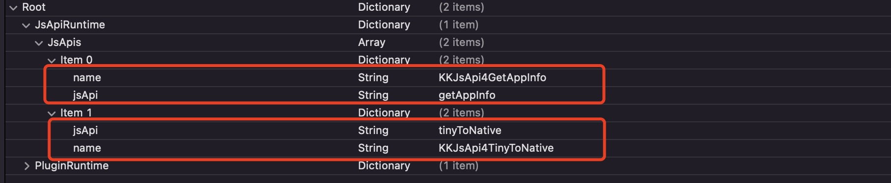

# 自定义 JSAPI

要从页面发起 Native 功能调用，例如显示一个 ActionSheet，或显示联系人对话框，您需要扩展一个 JavaScript API（JSAPI）。使用 JSAPI，可以让您在 H5 页面增加 Native 功能调用入口。通过实现自定义 JSAPI 类中的 handler 方法，以 Native 的形式实现特定功能。

H5 容器组件提供以下能力
- 丰富的内置 JSAPI，实现例如页面 push、pop、标题设置等功能。更多信息，请参见 内置 JSAPI。

- 支持用户自定义 JSAPI 和插件功能，扩展业务需求。

自定义一个 JSAPI 可以有以下两种方式：
-  **Plist 注册** 
-  **代码注册** 

## Plist 注册

1. 创建 JSAPI 类：

    ○ 命名规范：为与容器默认提供的插件命名保持一致，创建的 JSAPI 类命名以 XXJsApi4 开头，其中 XX 为自定义的前缀。

    ○ 基类：所有 JSAPI 均继承自 PSDJsApiHandler

    ○ 实现基础方法：在 .m 文件中，需重写方法 -(void)handler:context:callback:。当在前端调用此 JSAPI 时，会转发到此方法。

    ○ 该方法的参数含义如下:

|  参数 |  描述 |
|---|---|
|  data | H5 页面调用此 JSAPI 时传入的参数。  |
| context  |  当前 H5 页面的上下文，具体可参考 PSDContext.h。 |
| callback  | 调用此 JSAPI 完成后的回调方法，以字典方式传递调用结果到 H5 页面。  |

示例代码如下：

```
@implementation KKJsApi4TinyToNative

- (void)handler:(NSDictionary *)data context:(PSDContext *)context callback:(PSDJsApiResponseCallbackBlock)callback {
    [super handler:data context:context callback:callback];
    if (data != nil) {
        NSString *dataStr = [self dictionaryToJson:data];
        [self showToast:dataStr];
        callback(@{@"appNativeKey":@"appNativeValue"});
    }
}

@end
```

2. 注册 JSAPI。在自定义的 Plist 文件中注册此 JSAPI。

    ○ 为统一管理自定义的 JSAPI 和 Plugin，新建一个 Plsit 文件，您可以直接下载此模板文件 DemoCustomPlugins.bundle.zip 并添加到工程中。

    ○ 在 JsApis 数组下注册上一步创建的 JSAPI 类：

    

    ○ 注册的 JSAPI 是一个字典类型，包含以下两项内容:

   |  名称 | 描述 |
   |---|---|
   |  jsApi |  在 H5 页面中调用的 JSAPI 接口名 |
   |  name |  创建的 JSAPI 的类名。 |

    ○ 同时需在初始化容器配置时，指定自定义的 Plist 文件的路径。

      ○ 初始化 H5 容器

      示例代码如下：

```
- (void)application:(UIApplication *)application beforeDidFinishLaunchingWithOptions:(NSDictionary *)launchOptions
{
    // 初始化容器
    [MPNebulaAdapterInterface initNebula];

    //自定义 JSAPI 路径和预置离线包信息
    NSString *presetApplistPath = [[NSBundle mainBundle] pathForResource:[NSString stringWithFormat:@"h5_json.json"] ofType:nil];
    NSString *appPackagePath = [[NSBundle mainBundle] pathForResource:[NSString stringWithFormat:@"MPCustomPresetApps.bundle"] ofType:nil];
    NSString *pluginsJsapisPath = [[NSBundle mainBundle] pathForResource:[NSString stringWithFormat:@"MPCustomPluginsJsapis.bundle/Poseidon-UserDefine-Extra-Config.plist"] ofType:nil];
    [MPNebulaAdapterInterface initNebulaWithCustomPresetApplistPath:presetApplistPath customPresetAppPackagePath:appPackagePath customPluginsJsapisPath:pluginsJsapisPath];
}
```


