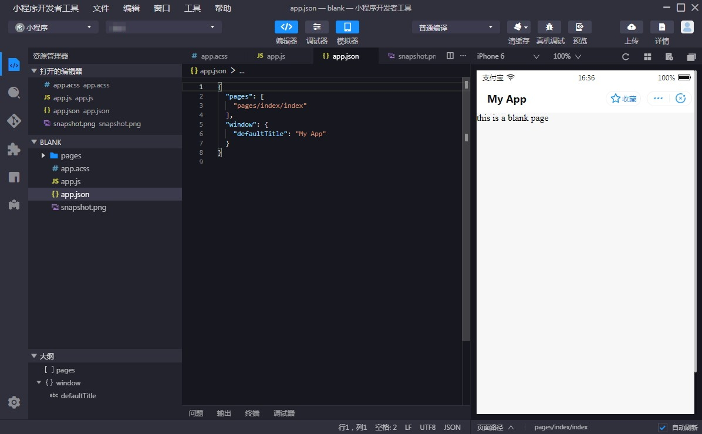

# 开发小程序

1. 下载IDE
2. 创建小程序
3. 下载配置文件
4. 登录小程序 IDE
5. 选择关联小程序
6. 编辑代码
7. 上传小程序
8. 发布小程序

## 下载 IDE

前往小程序  **下载中心** ，下载所需版本的小程序开发工具（IDE）。

## 创建小程

 1. 下载并安装小程序 IDE 后，打开 IDE，在左侧列表中选择 mPaaS > 小程序，并点击右侧的 + 打开创建页面
  

 2. 在  **新建项** 目 页面，输入 项目名称 并指定 项目路径，点击 完成 即可创建小程序项目。
  

## 下载配置文件

每创建一个新的环境，都需要上传从控制台下载的对应小程序的 IDE 配置文件。

1. 前往 mPaaS 控制台 > 小程序 > 小程序发布 > 配置管理，进入下载配置文件页面，在 IDE 配置管理 中点击 下载配置文件，下载小程序 IDE 配置文件。

   

2. 点击 下载配置文件 后，会弹出 下载配置文件 窗口，您需要在 动态密码 中输入一个密码， **该密码就是之后登录 IDE 时所使用的登录密码。** 

   

## 登录小程序 IDE

登录小程序 IDE 支持两种方式：
-  **动态密码登录方式** 
-  **Aliyun AccessKey 登录方式** 

### 动态密码登录方式

1. 在小程序 IDE 中，点击右上方的 登录。

   

2. 若未创建过登录环境，会弹出添加环境窗口；若已创建过登录环境，则会弹出登录窗口。

   ○ 如果您是 第一次创建登录环境，则在当前窗口输入环境名称，并上传从 mPaaS 控制台下载的 小程序 IDE 配置文件（config.json 文件）。

   ○ 如果您 已创建过登录环境，则点击窗口顶部的环境选择菜单，并选择菜单底部的 + 添加环境，并输入环境名称，上传从 mPaaS 控制台下载的 小程序 IDE 配置文件（config.json 文件）。

    

3. 点击 确定，即可创建新的登录环境。
4. 成功新增登录环境后，在登录窗口中，输入账号密码登录。
○ 账号是登录阿里云控制台的用户名。
○ 密码是在  **下载配置文件**  时设置的   **动态密码** 。

## 选择关联小程序

登录 IDE 后，在界面左上方，点击  **选择关联小程序** ，在下拉菜单中选择在控制台中创建的小程序。

## 编辑代码

选择关联小程序后，您就可以开始编辑小程序代码了。

## 上传小程序

完成代码编辑后，点击 IDE 界面右上方的 上传，即可将小程序上传至 mPaaS 控制台。

## 发布小程序

前往 mPaaS 控制台 > 小程序 > 小程序发布 进行发布操作，详情参见 发布小程序包
