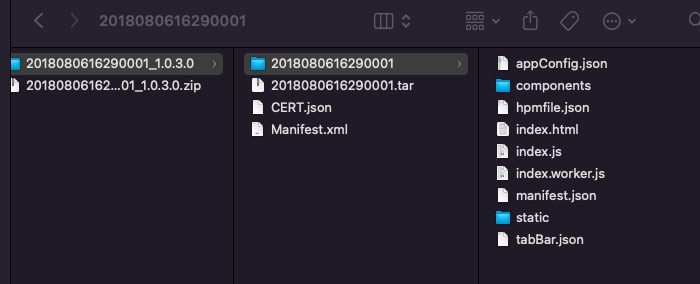

# 离线包简介

传统的 H5 技术容易受到网络环境影响，因而降低 H5 页面的性能。通过使用离线包，可以解决该问题，同时保留 H5 的优点。

离线包 是将包括 HTML、JavaScript、CSS 等页面内静态资源打包到一个压缩包内。预先下载该离线包到本地，然后通过客户端打开，直接从本地加载离线包，从而最大程度地摆脱网络环境对 H5 页面的影响。

使用 H5 离线包可以给您带来以下优势：

提升用户体验：通过离线包的方式把页面内静态资源嵌入到应用中并发布，当用户第一次开启应用的时候，就无需依赖网络环境下载该资源，而是马上开始使用该应用。

实现动态更新：在推出新版本或是紧急发布的时候，您可以把修改的资源放入离线包，通过更新配置让应用自动下载更新。因此，您无需通过应用商店审核，就能让用户及早接收更新。

## 离线包原理
您将从以下方面了解离线包原理：

- 离线包结构
- 离线包类型
- 渲染过程

### 离线包结构

离线包是一个 .amr 格式的压缩文件，将后缀 amr 改成 zip 解压缩后，可以看到其中包含了 HTML 资源和 JavaScript 代码等。待 H5 容器加载后，这些资源和代码能在 WebView 内渲染。

以 iOS 系统为例，下图显示了一般资源包的目录结构：

- 一级目录：一般资源包的 ID，如 2018080616290001
- 当前离线包默认打开的主入口文件，/index.html#pages/index/index

### 离线包类型
通常，在 H5 的开发过程中，会存在使用一些基础通用库的情况，比如 zepto，fastclick 等。在 App 中的 WebView，有时候缓存不可靠，曾经发现有机型在退出后，缓存自动失效。为了进一步提升 H5 页面性能，使用全局离线包，将一系列的通用资源打成一个特殊的 App 包，下发到客户端。

离线包可以分为以下类型：
-  **全局离线包** ：包含公共的资源，可供多个应用共同使用。
-  **私有离线** 包：只可以被某个应用单独使用。

使用全局离线包后，在访问 H5 的时候，都会尝试在这个包尝试读取。如果该离线包里有对应资源的时候，直接从该离线包里取，而不通过网络。因此，全局离线包的机制主要是为了解决对于通用库的使用。

由于要保证离线包的客户端覆盖率以及足够的通用性，此包一般的更新周期至少为 1 个月，并且严格控制离线包的大小。

### 渲染过程

当 H5 容器发出资源请求时，其访问本地资源或线上资源所使用的 URL 是一致的。

H5 容器会先截获该请求，截获请求后，发生如下情况：

- 如果本地有资源可以满足该请求的话，H5 容器会使用本地资源。
- 如果没有可以满足请求的本地资源，H5 容器会使用线上资源。
因此，无论资源是在本地或者是线上，WebView 都是无感知的。

离线包的下载取决于创建离线包时的配置：
- 如果 下载时机 配置为 仅 WiFi，则只有在 WiFi 网络时会在后台自动下载离线包。
- 如果 下载时机 配置为 所有网络都下载，则在非 WiFi 网络时会消耗用户流量自动下载，慎用。
- 如果当前用户点击 APP 时，离线包尚未下载完毕，则会跳转至 fallback 地址，显示在线页面。fallback 技术用于应对离线包未下载完毕的场景。每个离线包发布时，都会同步在 CDN 发布一个对应的线上版本，目录结构和离线包结构一致。fallback 地址会随离线包信息下发到本地。在离线包未下载完毕的场景下，客户端会拦截页面请求，转向对应的 CDN 地址，实现在线页面和离线页面随时切换。

### 离线包运行模式
要打开离线包，您需要完成以下步骤：
1. 请求包信息：从服务端请求离线包信息存储到本地数据库的过程。离线包信息包括离线包的下载地址、离线包版本号等。
2. 下载离线包：把离线包从服务端下载到手机
3. 安装离线包：下载目录，拷贝到手机安装目录。
