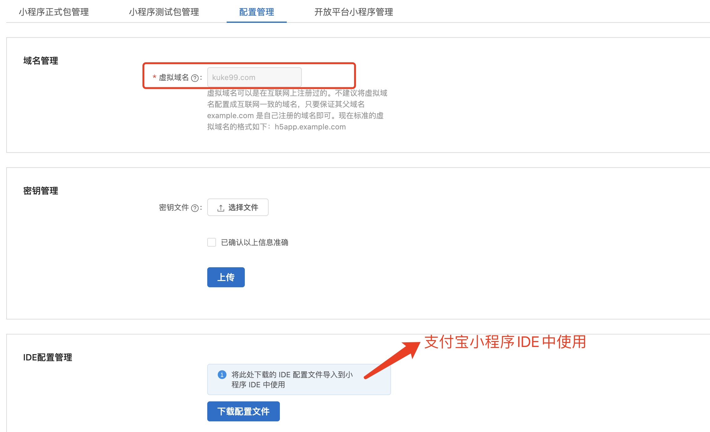
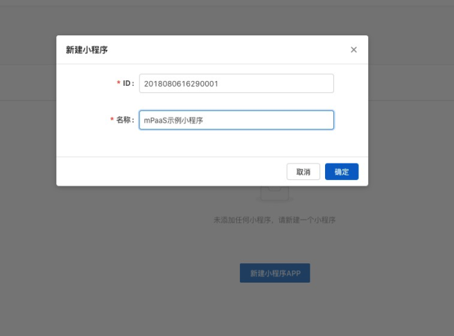
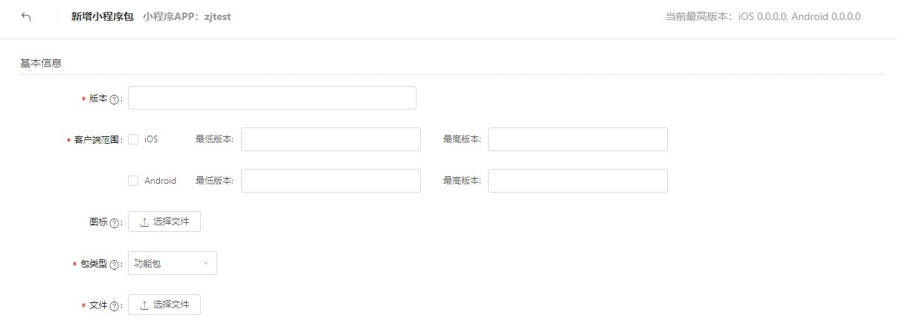
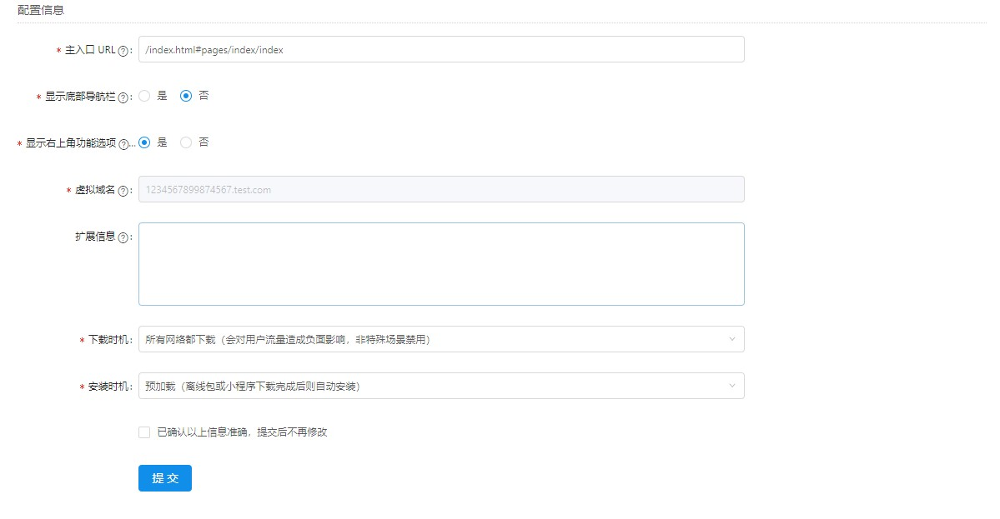

# 发布小程序

启动小程序之前，您需要先通过 mPaaS 控制台发布该小程序。

## 1. 进入小程序后台
登录 mPaaS 控制台，进入目标应用后，从左侧导航栏进入 小程序 > 小程序发布 页面

## 2. 配置虚拟域名

如果您是第一次使用，请先在 小程序 > 小程序发布 > 配置管理 中配置虚拟域名。虚拟域名可以为任意域名，建议使用您的企业域名，如 kuke99.com。

> 说明 一定要使用自己注册的域名。



## 3. 创建小程序

进入 mPaaS 控制台，完成以下步骤：
1. 单击左侧导航栏的 小程序 > 小程序发布。
2. 在打开的小程序包列表页，单击 新建。
3. 在 新建小程序 窗口，填写小程序的 ID 和小程序名称，单击 确定。其中，小程序 ID 为任意 16 位数字，例如 2018080616290001。

4. 在小程序 App 列表下，找到新增的小程序，单击 添加。
5. 在基本信息栏，完成以下配置：

   版本：填写小程序包的版本号，例如 1.0.0.0

   客户端范围：选择小程序 App 对应的 iOS 客户端最低版本和最高版本。在这个范围内的客户端 App 可以启动对应的小程序，否则无法启动。这里最低版本可以填写 0.0.0，最高版本可以不填，代表客户端所有版本都可以启动这个小程序。
> 这里的版本号指当前客户端 App 的版本号，请参考工程 Info.plist 中的 Product Version 字段。

    图标：单击 选择文件 上传小程序包的图标。第一次创建小程序时必需上传图标。示例图标如下

   文件：上传小程序包资源文件，文件格式为 .zip。我们为您准备了一个 mPaaS 示例小程序（点此下载），您可以直接上传



6. 在配置信息栏，完成以下配置：

    **主入口 URL** ：必填，小程序包的首页，例如 /index.html#page/tabBar/component/index。

    其他配置保持默认即可。



7. 勾选 ** 已确认以上信息准确，提交后不再修改** 
8. 单击  **提交** 

## 4. 发布小程序

进入 mPaaS 控制台，完成以下步骤：

1. 单击左侧导航栏的 小程序 > 小程序发布 > 小程序正式包管理
2. 在打开的小程序包列表页中，选择您要发布的小程序包与版本，单击  **创建发布** 。
3. 在创建发布任务栏，完成以下配置：

    **发布类型** ：选择 正式 发布类型。

    发布描述：选填
4. 单击 确定 完成发布创建。

## 5. 启动小程序

完成上述步骤之后，进入对应的页面时，调用框架提供的 startTinyAppWithId 接口方法加载小程序。


```objc
[MPNebulaAdapterInterface startTinyAppWithId:appId params:nil];
```
若打开小程序时需要传递参数，可以通过 param 参数进行设置。其中 param 包含 page 和 query 两个字段：


-  **page** ： 用来指定打开特定页面的路径。
-  **query** ：用来传入自定义的参数。多个键值对以 & 进行拼接。

```objc
NSDictionary *param = @{@"page":@"pages/card/index", @"query":@"own=1&sign=1&code=2452473"};
[MPNebulaAdapterInterface startTinyAppWithId:appId params:dic];
```


