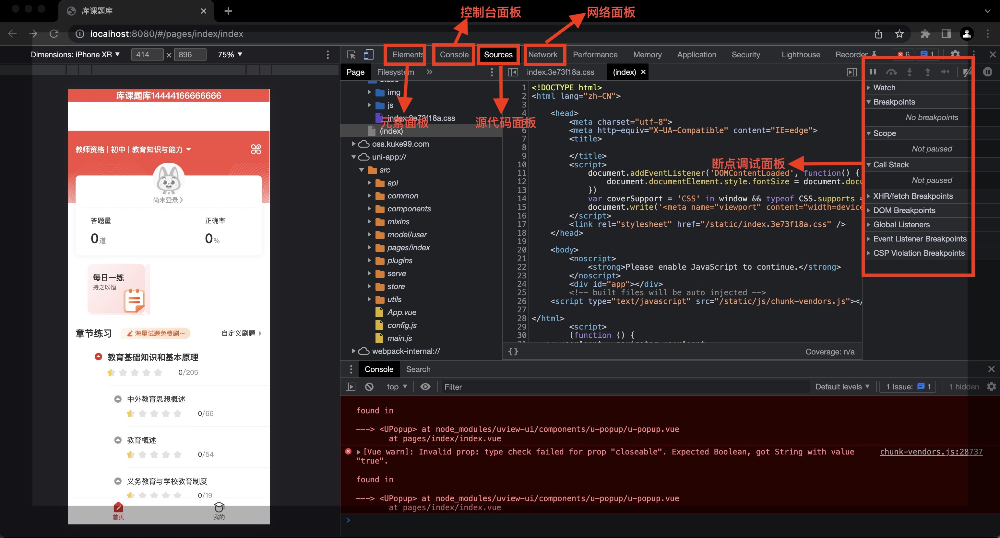
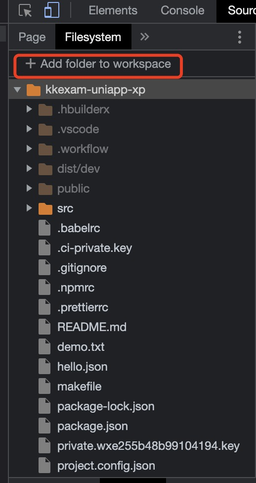

# uniapp小程序运行调试

以下以库课题库uniapp小程序为例：

1. 用Visual Studio 打开库课题库uniapp项目、在终端输入：

```
npm run dev:h5
```

出现如下信息即表示运行成功：


```
 DONE  Compiled successfully in 19161ms                                                                                                          
  App running at:
  - Local:   http://localhost:8080/ 
  - Network: unavailable
```
2. 复制 **http://localhost:8080/** 到 Chrome浏览器中打开发者工具进行调试。

3. Chrome调试面版



3.1: Elements (元素)面板

- 使用Elements面板通过自由操作DOM和CSS来反复调整网站的布局和设计。
- 检查和编辑页面与样式-检查和实时编辑 DOM 树中的任何元素(html标签)。
- 检查和编辑页面与样式-检查和编辑框模型参数。使用 Computed 窗格检查和编辑当前元素的框模型参数。 框模型中的所有值均可修改，只需点击它们即可。同轴矩形包含当前元素 padding、border 和 margin 属性的 top、bottom、left、right 值。

3.2： Console（控制台）面板

- 控制台可以查看诊断信息，显示原始和结构化数据，控制和过滤输出，检查和修改页面元素，测量执行时间等。
- 从命令行交互。控制台是一个完整的终端，您可以在开发过程中与页面进行交互。使用控制台的命令，您可以选择DOM元素，配置CPU，监视事件等。
- 一般情况下我们用来输入信息的方法主要是用到如下四个

```
1、console.log 用于输出普通信息

2、console.info 用于输出提示性信息

3、console.error用于输出错误信息

4、console.warn用于输出警示信息
```
3.3：Sources（源代码 ）面板

- 使用断点进行调试
- 使用开发者工具的工作区设置持久化-将本地源文件添加到工作区。要将本地文件夹的源文件设置为可以在 Sources 面板中修改，请执行以下操作。

```
 (1)右键点击左侧面板。

 (2)选择 Add Folder to Workspace。

 (3)选择您想要映射的本地文件夹的位置。

 (4)点击允许，授予 Chrome 访问该文件夹的权限。
```


3.4： Network(网络)面板

- Network面板基础知识。Network面板记录每个网络操作的信息，包括详细的时间数据，HTTP请求和响应头，cookies，WebSocket数据等。

- Network面板概述。当开发者工具打开时Network面板自动记录所有的网络活动。当你第一次打开它时是空的。重载页面开始记录，或者等着你的应用发起新的网络活动。每个请求资源被添加为Network table中的新的一行.


