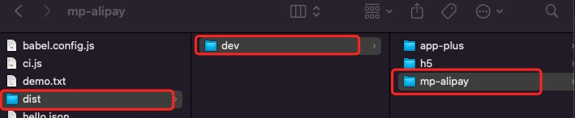

# uniapp导出小程序

## uniapp项目创建方式

- 通过HBUilderX可视化界面界面
- 通过vue-cli命令行

### 通过HBUilderX可视化界面界面

可视化的方式比较简单，HBuilderX内置相关环境，开箱即用，无需配置nodejs。
开始之前，开发者需先下载安装如下工具：
- HBuilderX： **官方IDE下载地址** 

HBuilderX是通用的前端开发工具，但为uni-app做了特别强化。

下载App开发版，可开箱即用；如下载标准版，在运行或发行uni-app时，会提示安装uni-app插件，插件下载完成后方可使用。

如使用cli方式创建项目，可直接下载标准版，因为uni-app编译插件被安装到项目下了。

- 创建uni-app
- 运行uni-app
- 发布uni-app

### 通过vue-cli命令行

#### 环境安装

全局安装vue-cli

```shell
npm install -g @vue/cli@4
```
#### 创建uni-app

- 使用正式版（对应HBuilderX最新正式版）

```shell
vue create -p dcloudio/uni-preset-vue my-project
```
- 使用alpha版（对应HBuilderX最新alpha版）

```shell
vue create -p dcloudio/uni-preset-vue#alpha my-alpha-project
```

- 使用Vue3/Vite版


```shell
px degit dcloudio/uni-preset-vue#vite my-vue3-project

```

#### 运行、发布uni-app

```shell
npm run dev:%PLATFORM%
npm run build:%PLATFORM%
```

 **%PLATFORM%**  可取值如下：

| 值  |  平台 |
|---|---|
| app-plus  |  app平台生成打包资源（支持npm run build:app-plus，可用于持续集成。不支持run，运行调试仍需在HBuilderX中操作） |
|  h5 | H5  |
| mp-alipay  | 支付宝小程序  |
|  mp-baidu |  百度小程序 |
| mp-weixin  | 微信小程序  |
|  mp-toutiao |  字节跳动小程序 |
|  mp-lark |  飞书小程序 |
| mp-qq | qq 小程序  |
|  mp-360 | 360 小程序  |
|mp-kuaishou | 快手小程序|
| mp-jd| 京东小程序|
| quickapp-webview|快应用(webview) |
| quickapp-webview-union| 快应用联盟|
|quickapp-webview-huawei | 快应用华为 |

以库课题库、图库图书为例 执行 

```shell
npm run build:mp-alipay
```
编译成功后，会在项目目录下生成编译好的支付宝小程序



将mp-aliapy小程序用支付宝开发工具运行查看效果即可。

### uniapp运行环境

#### uniapp项目开发工具

- HBUilderX
- Visual Studio (推荐)

node版本 
> 题库uniapp项目需要的node版本 **V14.X.X** ,更高的版本运行会报错，遇到项目运行不起来可以降低node版本

```shell
node -v
v14.18.2
```

npm版本

```shell
npm -v
6.14.15
```

vue/Cli版本
> 最新版本5.x.x 通过vue-cli命令行创建的uniapp项目如果在Visual Studio中运行报错，可以尝试将版本降低，选择更稳定的大版本。

```shell
vue -V
@vue/cli 4.5.15
```

安装指定vue版本的命令：

1：卸载最新版本vuecli5.0


```shell
sudo npm remove -g @vue/cli

```

2：安装vue4.5.15版本

```shell
sudo npm install -g @vue/cli@4.5.15
```


